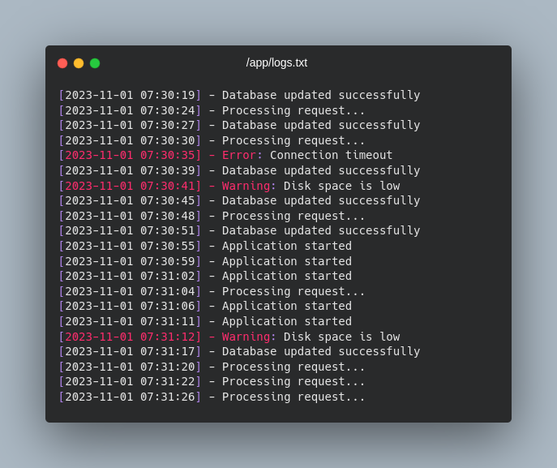

[⬅️ Back to repo home](https://github.com/Blankscreen-exe/docker-practice) ▪️ [↗️ Back to search](https://blankscreen-exe.github.io/docker-practice/)

# 004. Generate a log file outside of the container

Capturing the logs generated by an application in a file and binding it to a volume outside the container for data persistence.

## What You Will Do?

- [x] Host a logging app which creates random logs inside a text file.
- [x] Bind the log file with a directory in the host machine.
- [x] Configure a custom logger for docker.
- [x] Retrieve real-time logs.

## How To Do It?

You have two files in your aplication folder:

- `generate_logs.py` which acts as the main application.
- `app_logger.py` which acts a repository for helper functions.

There are two ways we can generate logs and persist log data:

### 1. Use a logger function (easy)

You can configure a logger function which will write application logs to a text file by appending lines of text.

The logger function is defined inside `app_logger.py` which can act as a repository for helper functions inside your application.
The `app_logger.py` uses two environment variables to work (as in any other proper application):

- `DEBUG` allows the logger function to generate log data.
- `LOG_FILE_PATH` tells the logger the location of the log file to write to.

To run this setup you can either use a single docker command:

```shell
cd 004.\ generate\ a\ log\ file\ outside\ of\ the\ container/
# build your image with name "log_generator"
docker build -t log_generator .
# start your image
docker run --name log_gen -v .:/app -w /app -e DEBUG=1 -e LOG_FILE_PATH="logs.txt" -d log_generator 
```
or alternatively, you can simply run the `docker-compose.yml` file which is the equivalent to the docker commands shown above:

```shell
cd 004.\ generate\ a\ log\ file\ outside\ of\ the\ container/
docker compose up
```

### 2. Configure a custom logger for docker (advanced)

...

## Log preview

You will see your logs being generated like this:



## Resources

- [Top 10 Docker logging Gotchas](https://sematext.com/blog/top-10-docker-logging-gotchas/)
- [Save Docker Compose logs to a file](https://stackoverflow.com/questions/35414495/save-docker-compose-logs-to-a-file)
- [How to redirect docker container logs to a single file](https://stackoverflow.com/questions/41144589/how-to-redirect-docker-container-logs-to-a-single-file)
- [directory of log files dont exist for docker container can see path but not access it](https://stackoverflow.com/questions/57227709/directory-of-log-files-dont-exist-for-docker-container-can-see-path-but-not-ac)
