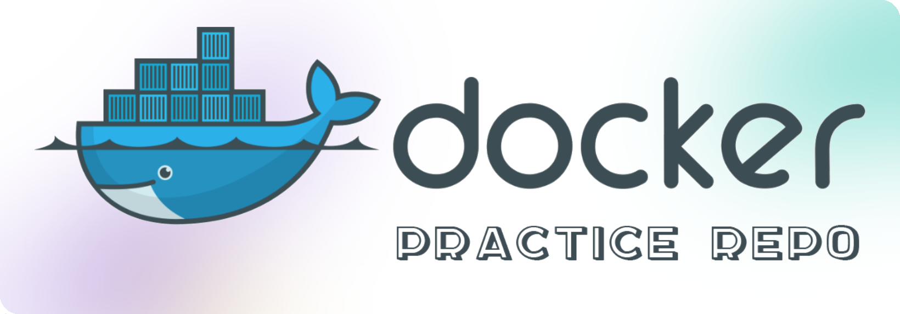

# Docker Practice

My practice with docker where I try out all sorts of things. This repository contains byte-sized tutorials revolving around `Docker`.

You can learn from it as well since I have categorized everything and have written clean code. Everything in there is well-documented.

> 📌 Each tutorial will be found inside a separate folder (with prefix `000.` where `000` can by any number)

# Index

<!-- 🔵 -->
<!-- 🟡 -->  
<!-- 🔴 -->

| Id | Status | Topic |
|----|----|----|
| 001 | 🔵        | [Dockerize a simple script](./001.%20dockerize%20a%20simple%20script/) |
| 002 | 🔵        | [Run and connect to a Postgres instance](./002.%20run%20and%20connect%20to%20a%20Postgres%20instance/)   |
| 003 | 🔵        | [Run and connect to a Redis instance](./003.%20run%20and%20connect%20to%20a%20Redis%20instance/) |
| 004 | 🟡         | [Generate a log file outside of the container]() |
| 005 | 🔴 | [Host an existing Wordpress project]() |
| 006 | 🔴 | [Use VSCode inside a Docker container for development]() |